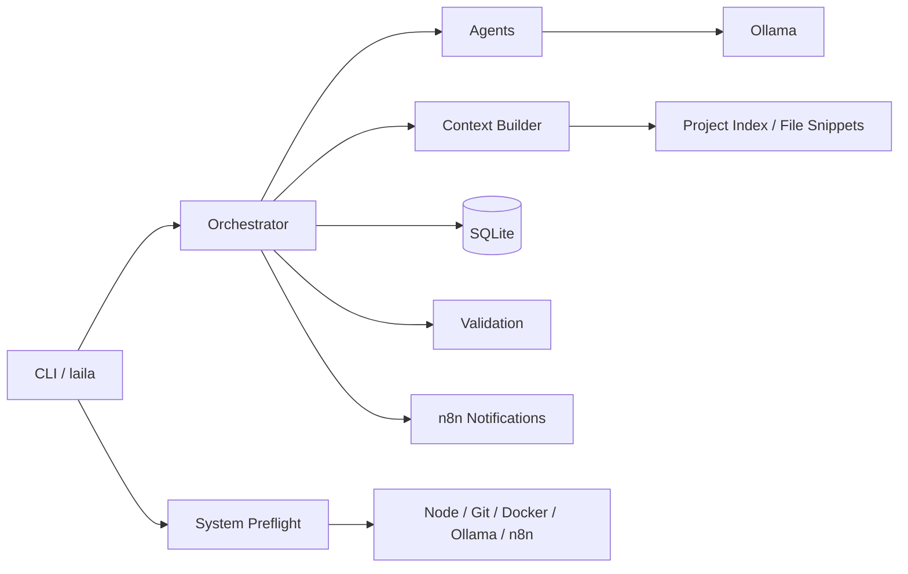

# Laila(Adv) Architecture

## System View

Laila(Adv) is a local-first CLI assistant for software engineering work. It is designed to keep context compact, execution auditable, and all runtime state local to the machine.

## Main Modules

- `core/src/cli` - user entry point, commands, REPL, status output, diagnostics
- `core/src/orchestrator` - intent detection, context assembly, agent selection, task lifecycle
- `core/src/agents` - role-specific prompt shaping for coder, reviewer, researcher, writer, and general
- `core/src/scanner` - repository analysis and project index generation
- `core/src/memory` - SQLite schema and persistence repositories
- `core/src/skills` - skill discovery and agent bundle mapping
- `core/src/validation` - build/lint/test execution for coding tasks
- `core/src/llm` - Ollama client and prompt builder
- `core/src/system` - readiness checks and safe remediation helpers

## Execution Flow

### Startup

1. `core/src/cli/index.ts` initializes the SQLite schema.
2. Running `laila` with `start` or no subcommand launches the interactive assistant.
3. The CLI performs a system preflight.
4. If the current working directory looks like a project, it is used automatically.
5. If not, the CLI prompts for a project path.
6. The project is scanned and indexed if needed.
7. The REPL starts and routes input through the orchestrator.

### Ask / REPL Turn

1. Intent detection maps the request to a task intent.
2. The task is persisted in SQLite.
3. The context builder loads the project summary, relevant files, history, and skill content.
4. The selected agent calls Ollama.
5. The result is stored as a task message.
6. Coding tasks can trigger validation.
7. Optional n8n notifications are sent without blocking the user.

## Data Flow

- File system -> scanner -> project index -> context builder
- User input -> intent detection -> agent -> Ollama -> response
- Task lifecycle -> SQLite -> history / status / doctor output
- Validation output -> task record -> CLI report

## Project Index Strategy

The project index exists to avoid shipping the whole repository to the model.

It captures:

- project name and framework
- languages and package manager
- grouped file paths by role
- route hints
- file hashes
- compact metadata for prompt building

## Agent Strategy

Agents are thin behavioral wrappers over the same Ollama model.

The role decides:

- the prompt framing
- the temperature setting
- the checklist or style constraints

The skills folder provides reusable behavior bundles and can be extended by the user.

## Reliability Strategy

- Keep all work local.
- Use a fixed model and low-temperature settings for code tasks.
- Run validation before accepting coding work.
- Keep optional integrations non-blocking.
- Fail loudly and suggest fixes through `doctor`.

## Operational Notes

- `laila start` starts an interactive REPL session with Laila(Adv).
- `laila ask <query>` asks a single question and exits.
- `laila scan` refreshes the project index.
- `laila status` displays current session and loaded project status.
- `laila history` shows recent task execution history.
- `laila skills` lists discovered skill bundles.
- `laila doctor` checks environment readiness.
- `laila doctor --fix` can create missing local folders.
